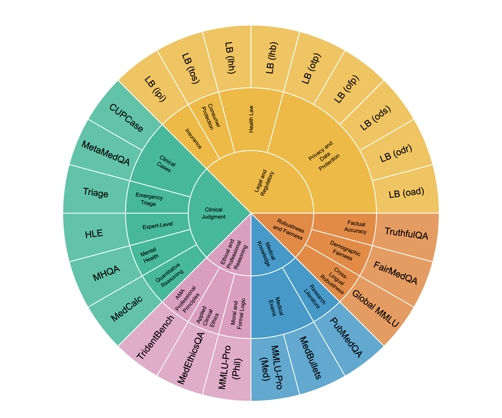

# Prj-BENCH

Benchmark data and zero-shot inference harness accompanying the paper.

This repository contains two things:

1. **The benchmark suite** — 24 multiple-choice benchmarks, released in both
   their original (pre-QC) and curated (post-QC) form.
2. **The zero-shot harness** — the code used to run the models over the suite
   via [OpenRouter](https://openrouter.ai).

```
benchmarks/
  pre_qc/            24 files, 10,020 items — the original suite, before QC
  curated/           24 files,  9,594 items — the post-QC suite used in the paper
  _manifest.csv      per-benchmark item counts, pre-QC vs curated
  _dropped_items.csv every item removed by QC, with the reason
harness/             zero-shot inference code
docs/                figures used in this README
requirements.txt
.env.example
```

## The benchmark suite



The suite spans five competency dimensions. Counts below are per benchmark, in
both releases; the source dataset is given as its Hugging Face identifier where
the set was pulled from the Hub.

### Clinical Judgment

| Benchmark | File | Pre-QC | Curated | Source dataset | Licence | Description |
| --- | --- | ---: | ---: | --- | --- | --- |
| **CUPCase** | `cupcase` | 700 | 700 | CUPCase | Apache-2.0 | Diagnosis from complex real-world clinical case reports |
| **HLE** | `hle` | 146 | 128 | `cais/hle` | MIT | Humanity's Last Exam — expert-level frontier questions; biology/medicine subset, text-only |
| **MHQA** | `mhqa` | 624 | 616 | MHQA | CC BY-NC 2.0 | Mental-health research literature QA |
| **MedCalc** | `medcalc` | 340 | 340 | `ncbi/MedCalc-Bench-v1.0` | CC BY-SA 4.0 | Medical calculation from clinical vignettes; integer/decimal outputs |
| **MetaMedQA** | `metamedqa` | 676 | 658 | `Maximegmd/MetaMedQA` | CC BY 4.0 | USMLE-style QA with unknown / unanswerable options (metacognition) |
| **Triage** | `triage` | 86 | 84 | `NLie2/TRIAGE` | CC BY 4.0 | Mass-casualty triage, recast as MCQ over a fixed 4-tier scale |

### Robustness and Fairness

| Benchmark | File | Pre-QC | Curated | Source dataset | Licence | Description |
| --- | --- | ---: | ---: | --- | --- | --- |
| **FairMedQA** | `fairmedqa` | 960 | 960 | FairMedQA | CC BY 4.0 | Demographic bias in clinical QA via counterfactual vignettes (race / income / gender) |
| **Global MMLU** | `global_mmlu` | 750 | 705 | Global MMLU | Apache-2.0 | Multilingual professional-medicine exam questions across 15 languages |
| **TruthfulQA** | `truthfulqa` | 790 | 790 | TruthfulQA | Apache-2.0 | Truthfulness and resistance to common misconceptions |

### Ethical and Professional Reasoning

| Benchmark | File | Pre-QC | Curated | Source dataset | Licence | Description |
| --- | --- | ---: | ---: | --- | --- | --- |
| **MMLU-Pro (Phil)** | `mmlupro_phil` | 237 | 200 | `TIGER-Lab/MMLU-Pro` | MIT | Philosophy, formal logic and moral-disputes categories |
| **MedEthicsQA** | `medethicsqa` | 1,000 | 928 | MedEthicsQA | CC BY-NC 4.0 | Medical ethics, stratified across the four core principles |
| **TridentBench** | `tridentbench` | 854 | 842 | TridentBench | MIT | Identifying which AMA Principle of Medical Ethics a scenario violates |

### Medical Knowledge

| Benchmark | File | Pre-QC | Curated | Source dataset | Licence | Description |
| --- | --- | ---: | ---: | --- | --- | --- |
| **MMLU-Pro (Med)** | `mmlupro_med` | 326 | 252 | `TIGER-Lab/MMLU-Pro` | MIT | Advanced clinical-knowledge and professional-medicine exam questions |
| **MedBullets** | `medbullets` | 308 | 188 | `LangAGI-Lab/medbullets_op5` | Apache-2.0 | USMLE Step 2/3-style clinical vignettes |
| **PubMedQA** | `pubmedqa` | 1,000 | 998 | `qiaojin/PubMedQA` | MIT | Yes / no / maybe QA over biomedical research abstracts |

### Legal and Regulatory

| Benchmark | File | Pre-QC | Curated | Source dataset | Licence | Description |
| --- | --- | ---: | ---: | --- | --- | --- |
| **LB (ipi)** | `ipi_legalbench` | 133 | 133 | `nguha/legalbench` | CC BY 4.0 | Insurance policy interpretation — is the claim covered? |
| **LB (lhb)** | `lhb_legalbench` | 66 | 65 | `nguha/legalbench` | CC BY 4.0 | Learned Hands: does the post concern public benefits or social services? |
| **LB (lhh)** | `lhh_legalbench` | 226 | 225 | `nguha/legalbench` | CC BY 4.0 | Learned Hands: does the post concern health care or medico-legal issues? |
| **LB (oad)** | `oad_legalbench` | 100 | 95 | `nguha/legalbench` | CC BY 4.0 | OPP-115: user access, edit and deletion clauses |
| **LB (odr)** | `odr_legalbench` | 100 | 94 | `nguha/legalbench` | CC BY 4.0 | OPP-115: data-retention clauses |
| **LB (ods)** | `ods_legalbench` | 100 | 97 | `nguha/legalbench` | CC BY 4.0 | OPP-115: data-security clauses |
| **LB (ofp)** | `ofp_legalbench` | 100 | 100 | `nguha/legalbench` | CC BY 4.0 | OPP-115: first-party collection and use clauses |
| **LB (otp)** | `otp_legalbench` | 100 | 98 | `nguha/legalbench` | CC BY 4.0 | OPP-115: third-party sharing and collection clauses |
| **LB (tos)** | `tos_legalbench` | 298 | 298 | `nguha/legalbench` | CC BY 4.0 | Classifying potentially unfair Terms-of-Service clauses |

Full citations for each source dataset are given in the paper. Each benchmark
remains subject to its original licence, listed above; several are
non-commercial (CC BY-NC), so the suite as a whole cannot be redistributed under
a single permissive licence.

## Benchmark format

Every file is a JSON array of items with a common schema:

```json
{
  "id": "professional_medicine/test/131/en",
  "question": "A 62-year-old man ...",
  "options": ["Begin ...", "Order ...", "Discharge ...", "Consult ..."],
  "target": 2,
  "kind": "professional_medicine"
}
```

`target` is the **0-based index into `options`** of the correct answer, in the
order given in the file. `kind` is an optional subcategory label and is absent
in some benchmarks. Question text and options are kept fully separable, which is
what makes the choice-only baseline possible.

### pre-QC vs curated

`pre_qc/` is the suite as originally assembled: 10,020 items. `curated/` is the
same suite after the quality-control pass described in the paper: 9,594 items,
with defective items excluded and duplicates removed. Three benchmarks were
rebuilt from source during QC rather than filtered — `medcalc`, `triage` and
`truthfulqa` — and both directories carry the rebuilt versions, so the two
releases hold the same 24 benchmark names and differ only in which items
survive. The `replaces_retired` column of `_manifest.csv` records the original
name in each case.

`_manifest.csv` gives the per-benchmark counts on both sides;
`_dropped_items.csv` lists all 447 removed items with the QC check that caught
each one and the decision taken. **Results reported in the paper are computed on
the curated set**, which is also the harness default.

## Running the zero-shot harness

### 1. Install

Python 3.10+ (the code uses `X | Y` type syntax).

```bash
python -m venv .venv && source .venv/bin/activate
pip install -r requirements.txt
```

### 2. Configure

```bash
cp .env.example .env
```

Then edit `.env` and set `OPENROUTER_API_KEY`. Everything else is optional; the
defaults shown in that file are the ones used for the paper — notably
`SHUFFLE_SEED=42`, which controls answer-option shuffling and must be kept
unchanged to reproduce the published runs.

### 3. Run

All commands are run from inside `harness/`.

```bash
cd harness

# Print the execution plan without spending anything — always start here
python run_experiment.py --dry-run

# One model, one benchmark
python run_experiment.py --models gpt-4o --benchmarks fairmedqa

# The full paper run: every model configuration × all 24 benchmarks
python run_experiment.py

# Run against the original pre-QC release instead
python run_experiment.py --data-dir ../benchmarks/pre_qc --experiment-id zeroshot_preqc
```

The full run is **26 model configurations × 9,594 items ≈ 249k API calls**. Cost
and time are substantial. Use `--dry-run` first and scope with `--models` /
`--benchmarks`.

Useful flags:

| Flag | Effect |
| --- | --- |
| `--models LABEL ...` | Restrict to model labels from `harness/config.py` (default: all 26) |
| `--benchmarks NAME ...` | Restrict to benchmark file stems (default: all 24) |
| `--data-dir PATH` | Benchmark directory to load (default: `benchmarks/curated`) |
| `--experiment-id ID` | Output folder name under `results/` (default: `zeroshot_v1`) |
| `--concurrency N` | Max in-flight API calls (default: 25) |
| `--retry-failed` | Re-run only items that errored or failed to parse |
| `--force` | Ignore resume state and re-run everything |
| `--dry-run` | Print the plan and exit without calling the API |
| `-v` | Debug logging |

Runs are **resumable**: results are appended per model/benchmark, and re-running
the same command picks up where it left off rather than repeating completed
items. Use `--force` only when you intend to discard prior results.

### 4. Output

```
results/<experiment_id>/
  <model_label>/<benchmark>.jsonl   one JSON record per item
  csv/master.csv                    all records flattened
  csv/by_model/<model_label>.csv
  csv/by_benchmark/<benchmark>.csv
  run.log
```

Each record carries the prompt condition, the model's answer, and accounting:
`permutation` and `correct_letter` (the shuffle actually shown to this model),
`selected_letter`, `selected_original_index`, `is_correct`, `confidence`,
`explanation`, `raw_content`, token counts, `cost_usd`, `latency_ms`, and
`error`. Because options are shuffled per (item, model), correctness is scored
by mapping the selected letter back through `permutation` to the original option
index and comparing against `target` — never by comparing letters directly.

`is_correct` is `null` for items with no parseable answer (a refusal, a
truncation, a malformed response). These are unscored, not wrong; the paper
drops them from the denominator and reports the counts separately.

## What is in `harness/`

| File | Role |
| --- | --- |
| `run_experiment.py` | CLI entry point |
| `config.py` | Paths, API settings, and the 26-entry model registry |
| `data_loader.py` | Loads and normalises the benchmark JSON |
| `prompt_builder.py` | Deterministic per-(item, model) option shuffling and prompt assembly |
| `api_client.py` | OpenRouter calls, retries, reasoning-config handling |
| `batch_runner.py` | Concurrency, resume, per-model orchestration |
| `output_parser.py` | Response parsing into the flat record schema |
| `make_csv.py` | JSONL → CSV |

The model registry in `config.py` holds the 26 configurations that were
dispatched. Four of them returned an API error on every request and produced no
usable data (`gpt-5`, `o3-mini`, `lfm2-8b`, `aion-2-0_base`), so the paper
reports **22 configurations across 19 models**; they are left in the registry so
the run is reproducible as executed. Models tested both with and without
reasoning appear twice, with different `label`s and a `reasoning_config` that is
passed through to the provider. Some entries carry model-specific `max_tokens`;
the comments in that file record why.

## Citation

Please cite the accompanying paper. Individual benchmarks are derived from
previously published sources and remain subject to their original licences; see
the paper for the full provenance of each of the 24 sets.
